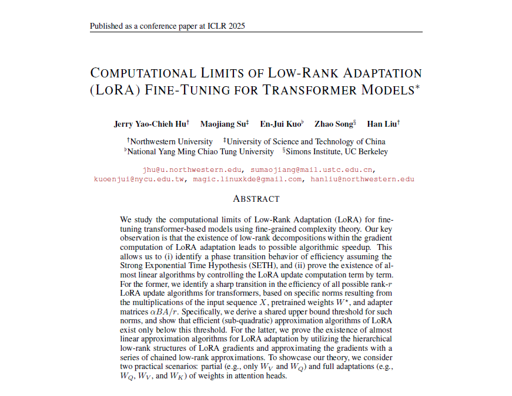

---

##### Download

+ [Paper](paper1.pdf)

---

##### Abstract

We study the computational limits of Low-Rank Adaptation (LoRA) update for finetuning transformer-based models using fine-grained complexity theory. Our key observation is that the existence of low-rank decompositions within the gradient computation of LoRA adaptation leads to possible algorithmic speedup. This allows us to (i) identify a phase transition behavior and (ii) prove the existence of nearly linear algorithms by controlling the LoRA update computation term by term, assuming the Strong Exponential Time Hypothesis (SETH).

---

##### Figure 6: Some Uses For Olive Oil

