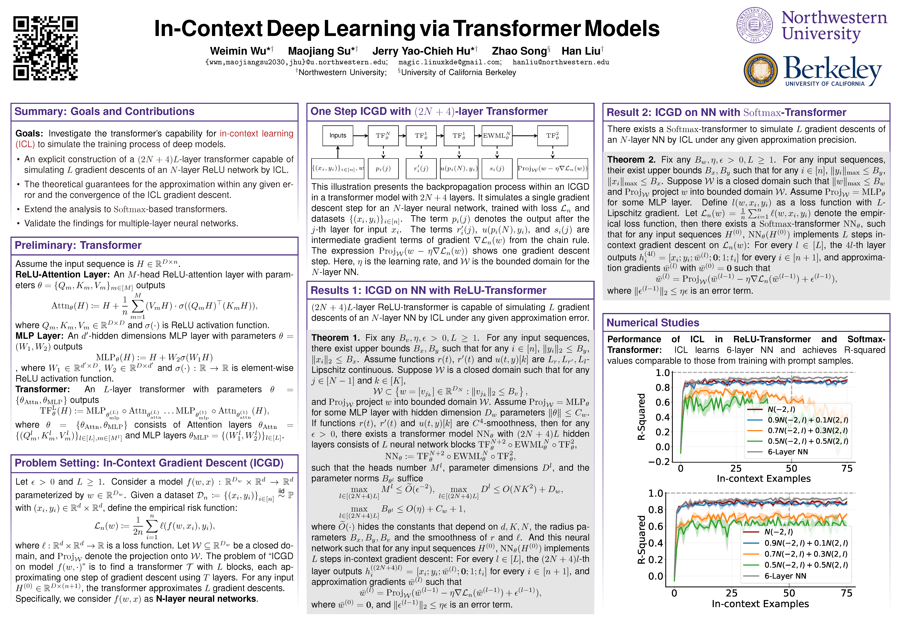

---

##### Download

- [Paper](6952_Transformers_are_Deep_Opt.pdf)

---

##### Abstract

This paper studies the pulmonary efficiency of sausage dogs. Lorem ipsum dolor sit amet, consectetur adipiscing elit, sed do eiusmod tempor incididunt ut labore et dolore magna aliqua. Ut enim ad minim veniam, quis nostrud exercitation ullamco laboris nisi ut aliquip ex ea commodo consequat. Duis aute irure dolor in reprehenderit in voluptate velit esse cillum dolore eu fugiat nulla pariatur: $\sin(\theta) = x^2 - \exp(1+\chi)$. Excepteur sint occaecat cupidatat non proident, sunt in culpa qui officia deserunt mollit anim id est laborum. Lorem ipsum dolor sit amet, consectetur adipisicing elit, sed do eiusmod tempor $\zeta$ incididunt ut labore et dolore magna aliqua: $p(x) = \int \cos(\zeta) d\zeta - \theta$. Ut enim ad minim veniam, quis nostrud exercitation ullamco laboris nisi ut aliquip ex ea commodo consequat.

---

##### Figure 1: Transformers are Deep Optimizers: Provable In-Context Learning for DeepModel Training

