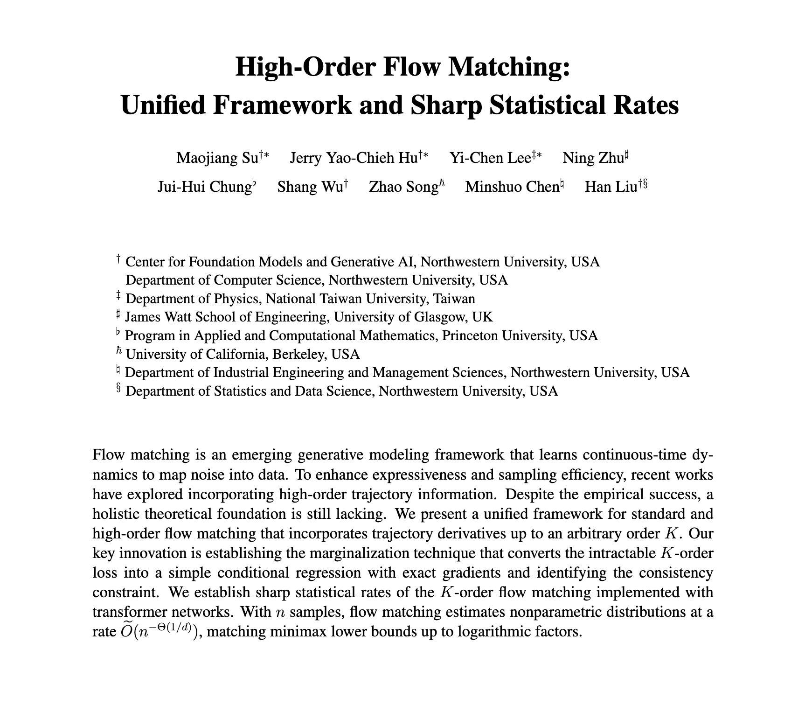

---

##### Download

+ [Paper](high_order_FM_ver_prelim.pdf)

---

##### Abstract

Flow matching is an emerging generative modeling framework that learns continuous-time dynamics to map noise into data. To enhance expressiveness and sampling efficiency, recent works have explored incorporating high-order trajectory information. Despite the empirical success, a holistic theoretical foundation is still lacking. We present a unified framework for standard and high-order flow matching that incorporates trajectory derivatives up to an arbitrary order $K$. Our key innovation is establishing the marginalization technique that converts the intractable $K$-order loss into a simple conditional regression with exact gradients and identifying the consistency constraint. We establish sharp statistical rates of the $K$-order flow matching implemented with transformer networks. With $n$ samples, flow matching estimates nonparametric distributions at a rate $\tilde{O}(n^{-\Theta(1/d)})$, matching minimax lower bounds up to logarithmic factors.

---

##### Figure: Computational limits of low-rank adaptation (lora) for transformer-based models

